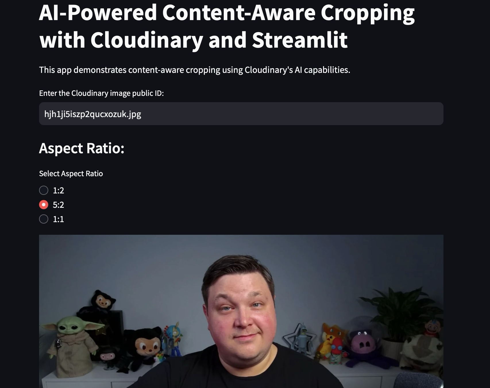

# Content-Aware Application with Streamlit and Cloudinary

## Overview

This project showcases how to build a content-aware application using Streamlit and Cloudinary. The application allows users to process both images and videos using Cloudinary's powerful AI-driven content-aware cropping and delivery capabilities. Users can input any Cloudinary public ID for images or videos, select from multiple aspect ratios, and instantly preview the results. With Cloudinary, you can easily deliver media to perfectly fit your graphic design and layout, on any device.



## Try It Out Live

You can try the application instantly without installation at:

[https://content-aware-st.streamlit.app](https://content-aware-st.streamlit.app)

## Prerequisites

To get started, ensure you have the following installed:

- Python 3.x
- Streamlit
- Cloudinary
- python-dotenv (for loading environment variables from a .env file)

You can install the required packages using pip:

```
pip install streamlit cloudinary python-dotenv
```

## Environment Variables

Before running the application, set up the following environment variables with your Cloudinary account details. You can place these in a `.env` file in the project root, or export them in your shell:

```bash
CLOUDINARY_CLOUD_NAME=your_cloud_name
CLOUDINARY_API_KEY=your_api_key
CLOUDINARY_API_SECRET=your_api_secret
```

Replace the placeholders with your actual Cloudinary credentials.


## Project Structure

The project consists of the following key files:

- **app.py**: The main application file where the Streamlit app is defined.
- **requirements.txt**: A file listing the required Python packages.

## Features

- **Image Cropping**: Input any Cloudinary image public ID and select from aspect ratios (1:2, 5:2, 1:1) for AI-powered content-aware cropping.
- **Video Cropping**: Input any Cloudinary video public ID and select from aspect ratios (1:2, 5:2, 1:1) for AI-powered content-aware cropping.
- **Dynamic Media Delivery**: Images and videos are processed and delivered via Cloudinary, ensuring optimal performance and responsiveness.
- **User-Friendly Interface**: Easily preview the results and experiment with different aspect ratios and media types.

## Example Public IDs

Below are example public IDs you can use to test the app with your own Cloudinary account (after setting your Cloudinary configuration values):

- Image: `profile_uzviqu`
- Video: `video-player/water-gushing`

*To use your own media, upload it to your Cloudinary account and use its public ID after updating the Cloudinary configuration values in your environment.*

## Running the Application

To run the application, navigate to the project directory in your terminal and execute:

```
streamlit run app.py
```

This command will start the Streamlit server. Open your browser to [http://localhost:8501](http://localhost:8501) to use the app.

## How It Works

The app uses Cloudinary's AI-powered transformations to automatically crop images and videos to the selected aspect ratio, focusing on the most important content. The user can experiment with different aspect ratios and public IDs to see the results in real time.

## Author

- Teri

## Contributing

Contributions are welcome! Please feel free to submit a pull request or open an issue.
